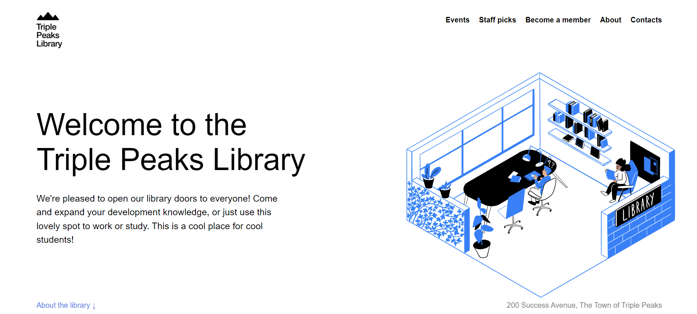
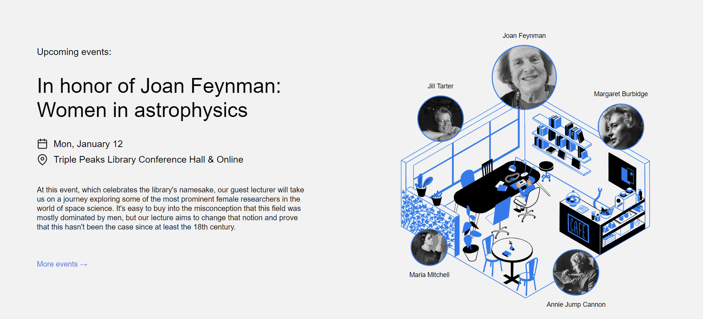

# Project 1: Triple Peaks Library

The Triple Peaks Library webpage is the first project in the Software Engineer program at TripleTen. It was created using HTML and CSS, based on a design brief.

## Project features

- Semantic HTML5
- Flexbox
- Positioning
- Vertical stacking with z-index

## Project's screenshots

## You're welcome to visit the page yourself:

[Triple Peaks Library - Here!](https://dayana-pugachov.github.io/se_project_library/)
